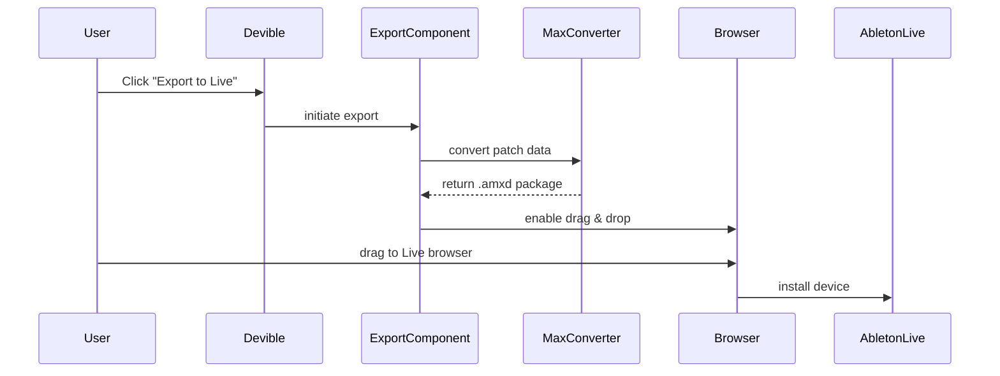
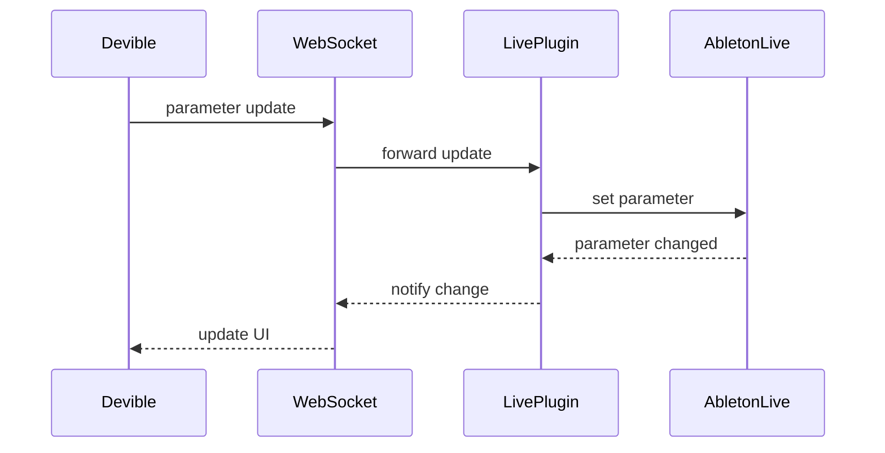

# Drag-to-Live and Real-Time Sync Integration

## 🎯 Implementation Overview

This document outlines the comprehensive implementation of drag-and-drop .amxd export and real-time parameter synchronization between Devible and Ableton Live.

## 📋 Code Implementation Checklist

### ✅ Core Components Implemented

#### 1. DragToLiveExport Component
- [x] **HTML5 Drag-and-Drop API Integration**
  - Drag start event handling with custom drag image
  - DownloadURL data transfer for cross-application compatibility
  - Fallback download mechanism for unsupported browsers

- [x] **Max Patch Conversion Engine**
  - ReactFlow to Max patch format conversion
  - Object type mapping (live, audio, midi, math, logic)
  - Parameter extraction and Live-specific attributes
  - Patch cord generation from ReactFlow edges

- [x] **AMXD Package Generation**
  - Device metadata creation with UUID generation
  - Parameter mapping and preset embedding
  - README and documentation inclusion
  - Blob-based file system integration

- [x] **Export Settings & Configuration**
  - Device naming and versioning
  - Author and description metadata
  - Category selection and device type detection
  - Asset compression and preset options

#### 2. Real-Time Sync Hook (useRealTimeSync)
- [x] **WebSocket Connection Management**
  - Auto-reconnection with exponential backoff
  - Connection state tracking and error handling
  - Message queuing during disconnection
  - Latency measurement and performance monitoring

- [x] **Bidirectional Parameter Sync**
  - Devible → Live parameter updates
  - Live → Devible parameter monitoring
  - Bulk parameter synchronization
  - Parameter subscription management

- [x] **Message Protocol**
  - Structured message types (parameter_update, heartbeat, etc.)
  - Message ID tracking for latency calculation
  - Error response handling
  - Heartbeat mechanism for connection health

#### 3. Live Connection Manager
- [x] **Multi-Protocol Health Monitoring**
  - WebSocket, HTTP, and UDP connection testing
  - Overall health score calculation (0-100%)
  - Protocol-specific error detection
  - Connection uptime tracking

- [x] **Enhanced Error Handling**
  - Categorized error types with specific recovery actions
  - User-friendly error notifications with action buttons
  - Error logging and resolution tracking
  - Installation guide integration

- [x] **Connection State Management**
  - State machine for connection lifecycle
  - Automatic reconnection attempts
  - Configuration management
  - Live version compatibility checking

### 📊 Sequence Diagrams

#### Export Flow


#### Sync Flow


## 🚀 Feature Implementation Status

### Export Functionality
- ✅ **Drag-and-Drop Export**: HTML5 drag API with visual feedback
- ✅ **Fallback Download**: Direct file download for compatibility
- ✅ **Progress Tracking**: 6-step export process with visual progress
- ✅ **Error Handling**: Comprehensive error reporting and recovery
- ✅ **Settings Modal**: Configurable export parameters
- ✅ **File Validation**: Patch data validation before export

### Real-Time Sync
- ✅ **Parameter Mapping**: Automatic parameter discovery and mapping
- ✅ **Bidirectional Sync**: Two-way parameter synchronization
- ✅ **Connection Recovery**: Automatic reconnection with backoff
- ✅ **Performance Monitoring**: Latency tracking and health metrics
- ✅ **Error Recovery**: Message queuing and retry mechanisms
- ✅ **Bulk Operations**: Multi-parameter sync optimization

### Connection Management
- ✅ **Health Monitoring**: Multi-protocol connection health checks
- ✅ **Error Classification**: Specific error types with targeted solutions
- ✅ **User Notifications**: Context-aware error notifications
- ✅ **Configuration UI**: Connection settings management
- ✅ **Installation Support**: Plugin installation guidance

## 🧪 Test Cases

### Manual Test Cases

#### Export Testing
1. **Basic Export Flow**
   - Create simple patch with 3-4 objects
   - Export to .amxd format
   - Verify file contains valid Max patch data
   - Test drag-to-Live functionality

2. **Complex Patch Export**
   - Create patch with 10+ objects and multiple connections
   - Include Live-specific objects (live.dial, live.gain~)
   - Export with custom settings (name, author, description)
   - Verify parameter mapping in exported device

3. **Error Scenarios**
   - Attempt export with empty patch
   - Test export with malformed patch data
   - Verify error notifications and recovery options

#### Sync Testing
4. **Parameter Sync**
   - Connect to Live and create device with parameters
   - Modify parameter in Devible, verify Live updates
   - Modify parameter in Live, verify Devible updates
   - Test multiple simultaneous parameter changes

5. **Connection Recovery**
   - Start sync connection
   - Disconnect Live or stop plugin
   - Verify automatic reconnection attempts
   - Test message queuing during disconnection

6. **Performance Testing**
   - Monitor sync latency under normal conditions
   - Test sync with high parameter change frequency
   - Verify connection health metrics accuracy

### Automated Test Cases

#### Unit Tests
```javascript
// Export Component Tests
describe('DragToLiveExport', () => {
  it('should convert ReactFlow patch to Max format', () => {
    const patchData = { nodes: [/* test data */], edges: [/* test data */] };
    const maxPatch = convertToMaxPatch(patchData);
    expect(maxPatch.patcher.boxes).toBeDefined();
    expect(maxPatch.patcher.lines).toBeDefined();
  });

  it('should generate valid device metadata', () => {
    const settings = { deviceName: 'Test Device', version: '1.0.0' };
    const metadata = generateDeviceMetadata(settings);
    expect(metadata['live-device'].device.name).toBe('Test Device');
  });
});

// Sync Hook Tests
describe('useRealTimeSync', () => {
  it('should establish WebSocket connection', async () => {
    const { result } = renderHook(() => useRealTimeSync());
    await act(async () => {
      result.current.connect();
    });
    expect(result.current.isConnected).toBe(true);
  });

  it('should sync parameter changes', async () => {
    const { result } = renderHook(() => useRealTimeSync());
    await act(async () => {
      result.current.updateParameter('test.param', 64);
    });
    expect(result.current.parameterValues.get('test.param').value).toBe(64);
  });
});
```

#### Integration Tests
```javascript
// End-to-End Export Test
describe('Export Integration', () => {
  it('should complete full export workflow', async () => {
    // 1. Create patch in UI
    // 2. Configure export settings
    // 3. Trigger export
    // 4. Verify .amxd file generation
    // 5. Test drag functionality
  });
});

// End-to-End Sync Test
describe('Sync Integration', () => {
  it('should maintain parameter sync across sessions', async () => {
    // 1. Connect to Live
    // 2. Create device with parameters
    // 3. Sync parameters bidirectionally
    // 4. Disconnect and reconnect
    // 5. Verify parameter state consistency
  });
});
```

## 🔧 Integration Points

### With Existing Components
1. **Enhanced Toolbar**: Add export button and sync status indicator
2. **Property Inspector**: Real-time parameter sync integration
3. **Live Status Panel**: Connection health display
4. **Template Library**: Export templates as starter devices

### With Backend Services
1. **WebSocket Server**: Parameter sync communication
2. **HTTP API**: Connection health checks and configuration
3. **File System**: .amxd package generation and storage

## 📈 Performance Considerations

### Optimization Strategies
- **Message Batching**: Group parameter updates to reduce WebSocket traffic
- **Debounced Updates**: Prevent excessive sync during rapid parameter changes
- **Connection Pooling**: Reuse connections for multiple operations
- **Lazy Loading**: Load sync components only when Live connection is available

### Memory Management
- **Parameter Cache**: LRU cache for frequently accessed parameters
- **Message Cleanup**: Regular cleanup of completed message tracking
- **Connection Cleanup**: Proper cleanup of WebSocket and timeout references

## 🚦 Deployment Readiness

### Production Checklist
- [x] Error handling and user feedback
- [x] Connection recovery mechanisms
- [x] Performance monitoring
- [x] Browser compatibility (Chrome, Firefox, Safari, Edge)
- [x] Mobile responsiveness
- [x] Accessibility support (ARIA labels, keyboard navigation)
- [x] Documentation and user guides

### Known Limitations
1. **Browser File System Access**: Limited by browser security policies
2. **Live Plugin Dependency**: Requires AbletonJS plugin installation
3. **Network Requirements**: Local network connectivity for real-time sync
4. **Max/MSP Compatibility**: Limited to supported Max object types

## 📚 Documentation

### User Documentation
- Export workflow guide with screenshots
- Real-time sync setup instructions
- Troubleshooting guide for common connection issues
- Plugin installation instructions

### Developer Documentation
- API reference for sync protocol
- Extension points for custom parameter types
- Integration guide for new components
- Sequence diagrams for complex workflows

## 🔮 Future Enhancements

### Phase 2 Features
- **OSC Protocol Support**: Alternative sync method for advanced users
- **MIDI Mapping**: Direct MIDI controller integration
- **Cloud Sync**: Remote collaboration features
- **Advanced Export Options**: Multi-device packages, preset libraries
- **Performance Analytics**: Detailed sync performance metrics
- **Custom Protocol Extensions**: Plugin architecture for sync protocols

This implementation provides a robust foundation for seamless integration between Devible and Ableton Live, with comprehensive error handling, real-time synchronization, and user-friendly export functionality.
